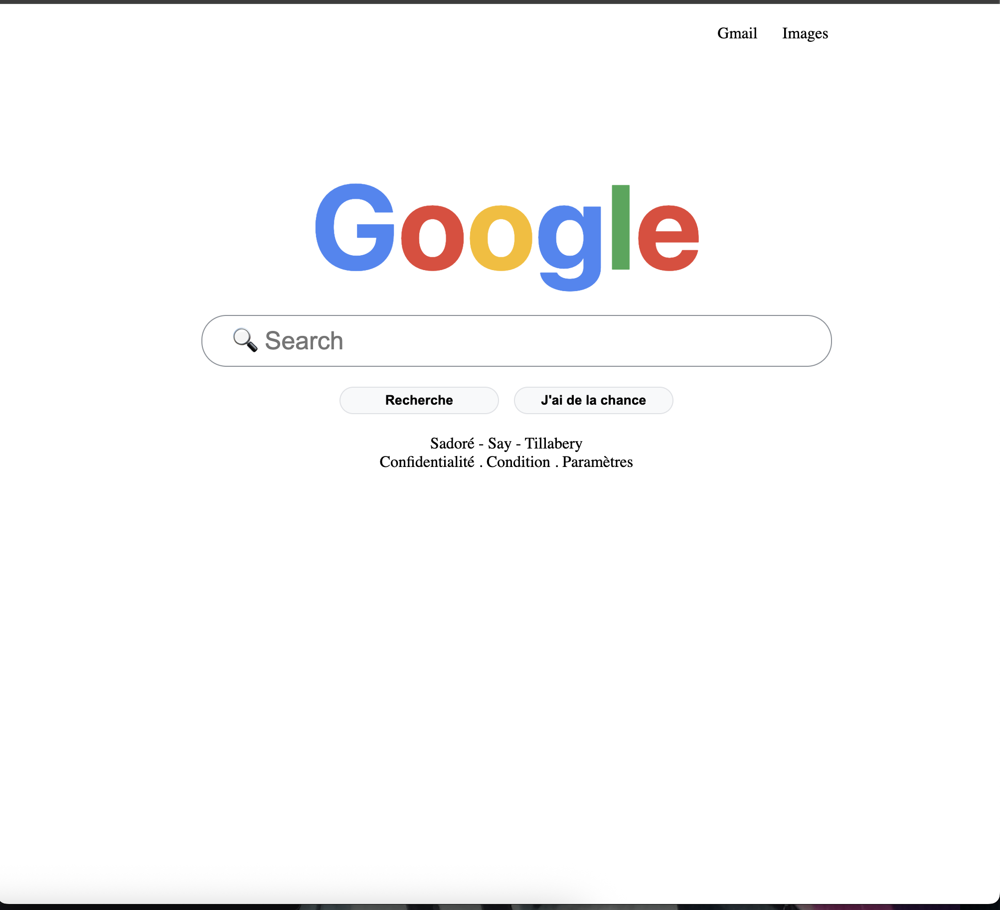

# Google Home Page Clone

Ce projet consiste à **recréer la page d’accueil de Google** en utilisant uniquement **HTML** et **CSS**.  
L’objectif est de pratiquer la **structuration sémantique**, la **mise en forme CSS** et le **responsive design**, tout en reproduisant fidèlement une interface web déja Donner.

##  Objectifs pédagogiques

 Découvrir la **structure de base d’une page HTML**.  
 Utiliser les **balises sémantiques** (`<header>`, `<main>`, `<footer>`).  
 Appliquer et organiser les **styles CSS** dans une feuille externe.  
 Créer une page **responsive**, adaptée à tous les écrans (mobile → desktop).  
 Séparer le **contenu (HTML)** de la **présentation (CSS)**.  
 Maintenir un **code propre, indenté et bien commenté**.

# Technologies utilisées

 **HTML5**  
 **CSS3** (flexbox, responsive design, hover, variables CSS) est surtous le box_shadow
 **Ici vous verrais une capture d'écrant de ma page**

